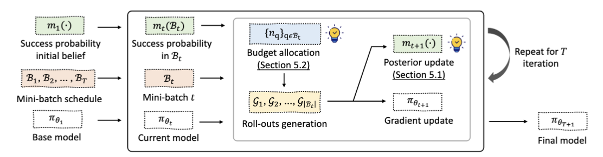

# Official implementation of "Adaptive Rollout Allocation for Online Reinforcement Learning with Verifiable Rewards" (ICLR'26)

<a href="http://arxiv.org/abs/2602.01601"></a>
<div align="center">
  <a href="https://hieunt91.github.io/" target="_blank">Hieu&nbsp;Trung&nbsp;Nguyen</a> &emsp;
  <a href="https://nguyenngocbaocmt02.github.io/" target="_blank">Bao&nbsp;Nguyen</a> &emsp;
  <a href="https://scholar.google.com/citations?user=noVgEXEAAAAJ&hl=zh-CN" target="_blank">Wenao&nbsp;Ma</a> &emsp;
  <a href="https://zhaoyuzhi.github.io/" target="_blank">Yuzhi&nbsp;Zhao</a> &emsp;
  <a href="https://scholar.google.com/citations?user=F_BO0z4AAAAJ&hl=en" target="_blank">Ruifeng&nbsp;She</a> &emsp;
  <a href="https://www.vietanhnguyen.net/" target="_blank">Viet&nbsp;Anh&nbsp;Nguyen</a> &emsp;
  <br> <br>
</div>
<br>

<div align="center">
    
</div>


Details of algorithms and experimental results can be found in [our paper](http://arxiv.org/abs/2602.01601):
```bibtex
@inproceedings{nguyen2026adaptive,
  title={Adaptive Rollout Allocation for Online Reinforcement Learning with Verifiable Rewards},
  author={Nguyen, Hieu Trung and Nguyen, Bao and Ma, Wenao and Zhao, Yuzhi and She, Ruifeng and Nguyen, Viet Anh},
  booktitle={International Conference on Learning Representations},
  year={2026}
}
```
Please consider citing this paper if it is helpful for you.


## Setup

Firstly, define a .env in the root directory of this repository with the following content. Please change the paths according to your local environment.:
```
HOME_DIR=/path-to/VIP
BASE_MODEL_DIR=${HOME_DIR}/base_models
CKPTS_DIR=${HOME_DIR}/ckpts
DATA_DIR=${HOME_DIR}/data
TENSORBOARD_DIR=${HOME_DIR}/logs/tensorboard_logs
RAY_TMPDIR=${HOME_DIR}/ray_tmp
VERL_FILE_LOGGER_ROOT=${HOME_DIR}/logs/file_logs
VLLM_USE_V1=1
```

Dependency installation:
```
pip install -e . 
cd src/verl/ 
USE_MEGATRON=0 bash scripts/install_vllm_sglang_mcore.sh
pip install ninja 
pip install --no-build-isolation flash-attn==2.7.2.post1
pip install --no-deps -e .
```

Setup datasets, base models and cache embeddings:
```
bash experiments/math/scripts/prepare_base_model.sh
bash experiments/math/scripts/prepare_vip_data.sh
python3 src/vip/embedding/cache_embeddings.py --dataset ${HOME_DIR}/data/vip-dapo-math-17k.parquet --embedding_cache_dir tmp/
```

Notes:
- After download base models, please modify the max_position_embeddings in config.json to 32768 to avoid potential context length overflow issue.

## Examples of running VIP on the Math domain:

To train your model using VIP from base model, you can run the following command. Note that you can change the advantage estimator, budget range and base model by changing the corresponding environment variables:
```
ADVANTAGE_ESTIMATOR=rloo LOWER_BUDGET=8 UPPER_BUDGET=32 BUDGET=16 BASE_MODEL=Qwen2.5-Math-1.5B bash experiments/math/scripts/run_vip.sh
```

Notes:
- do not set LOWER_BUDGET < 4 
- VIP needs around 15 gradient steps to warm up the success rate prediction. To reproduce the results in paper, use experiments/math/scripts/run_baselines.sh to run a vanilla GRPO/RLOO run with the same rollout budget. Then use VIP to train the checkpoints at step 15. 
- rollout data (training step, accuracy of each question) are stored inside logs/file_logs/run_name. Make sure to copy rollout data of the first 15 steps from the vanilla GRPO/RLOO to (e.g. logs/file_logs/VIP-Qwen2.5-Math-1.5B/run_name-rollout_data.json) run to the VIP run to ensure a smooth warmup.
- You can also directly train VIP from the base model without warmup but you might get a noisier results.

## Acknowledgement
Our code is built on top of [Verl](https://github.com/verl-project/verl) and DAPO. 

## Contact
Please feel free to contact us if you have any questions about the code or the paper. 

Email: <a href="mailto:hilljun.2000@gmail.com">hilljun.2000@gmail.com</a>